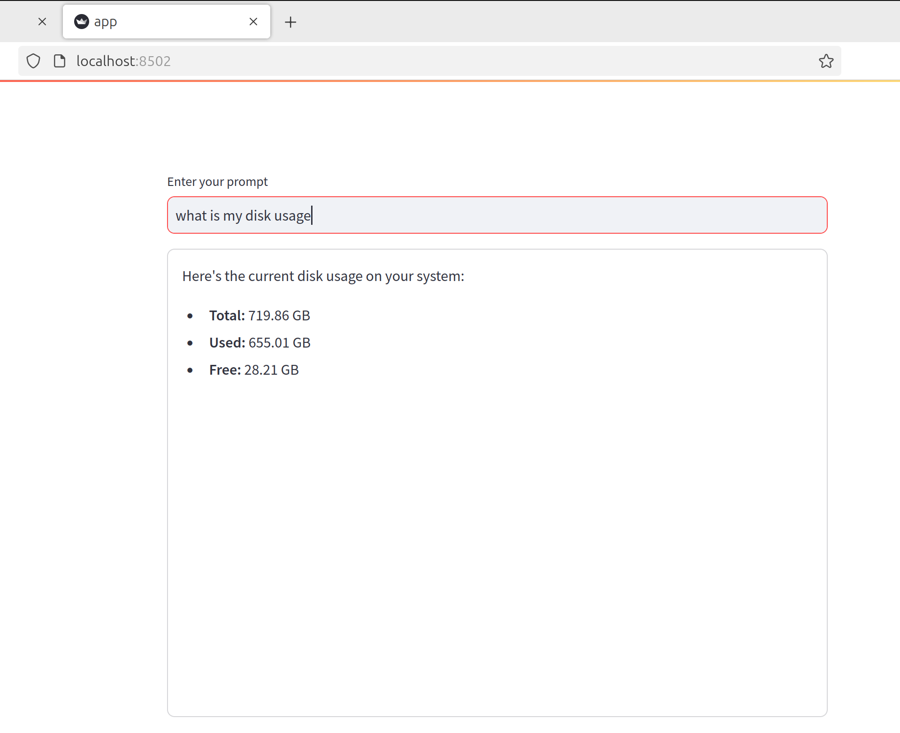

# 𝑓 Function Calling Demo Application

Demo function calling app.
Function calling in Large Language Models is essential to provide it with the access to real time data, take actions on your behalf or perform computation. 
Learn how to use Function Calling in your LLM application utilizing LangChain, Ollama and Streamlit!

## 📸 App Screenshots

Below are the screenshots of the app in action:

<p float="left">
  
  
</p>   

## 🔨 Setting up locally

Follow these steps to set up and run the app locally:

### 1. Install Dependencies

Create a virtual environment and install dependencies:

```bash
pip install pipenv

pipenv install

pipenv run pip install -r requirements.txt

```

### 2. Run the App

```bash

pipenv run streamlit app.py

```

### 3. Pull Ollama

```bash

ollama pull mistral-nemo:latest

```
